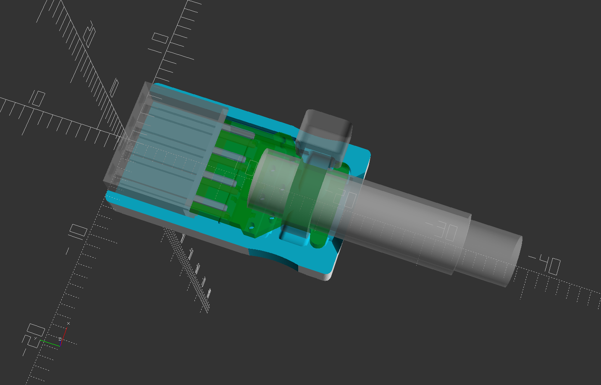
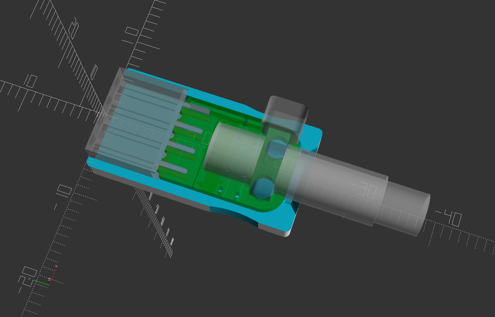
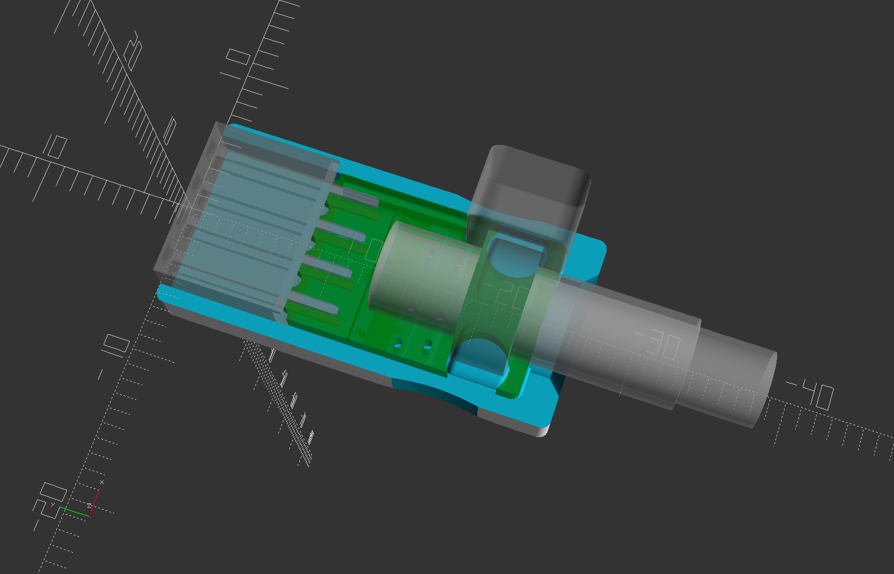
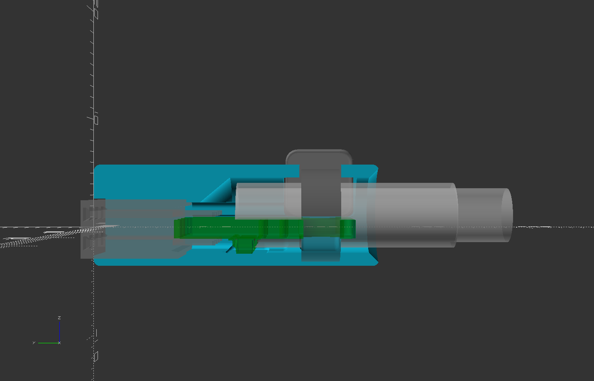
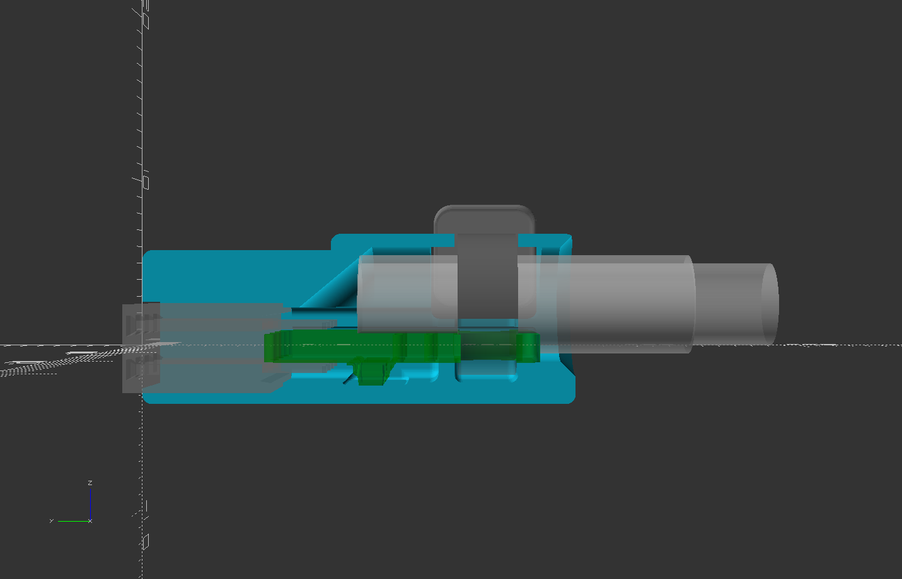
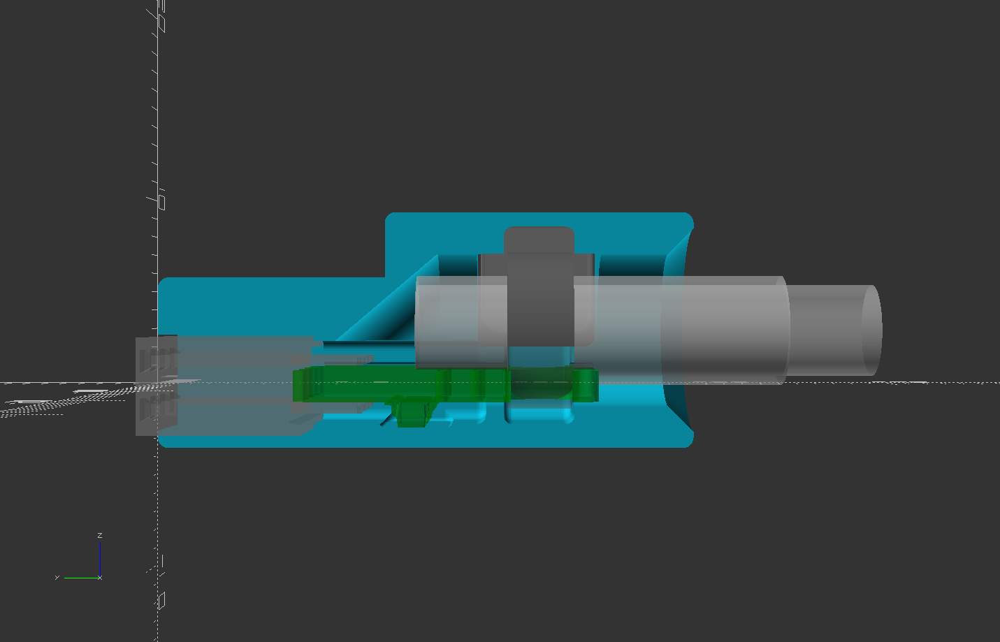
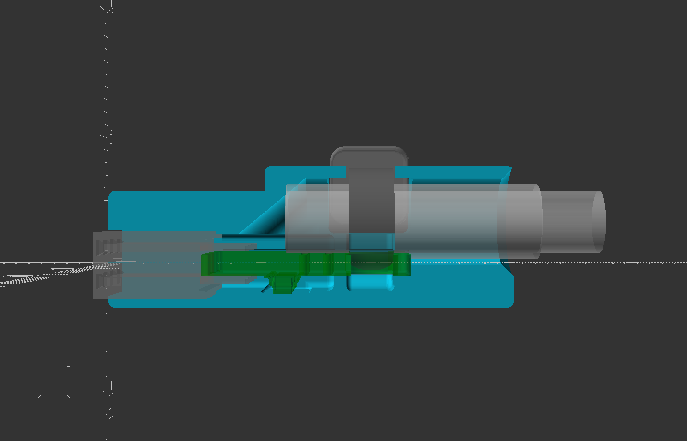

The filenames indicate the body style and which pcb it supports.  
IE: stl/TPDD_Cable_Housing.3B.stl is housing type B for pcb type 3.

| | PCB Shape | Soldering Jig |
| --- | --- | --- |
| PCB 1 |  |  |
| PCB 2 |  |  |
| PCB 3 |  |  |

| | | | |
| --- | --- | --- | --- |
| Type A |  |  |  |
| Type B |  |  |  |
| Type C |  |  |  |
| Type D |  |  |  |
