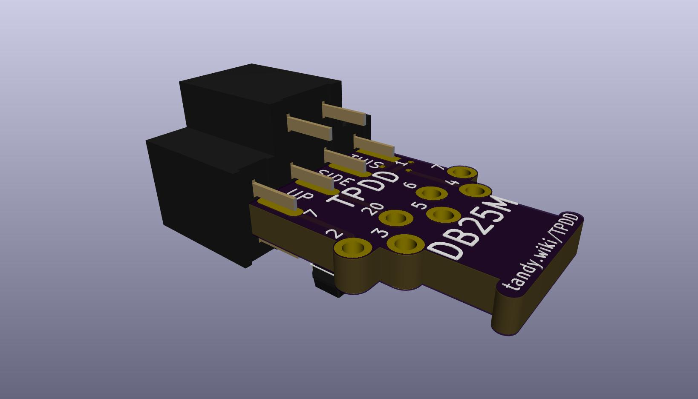
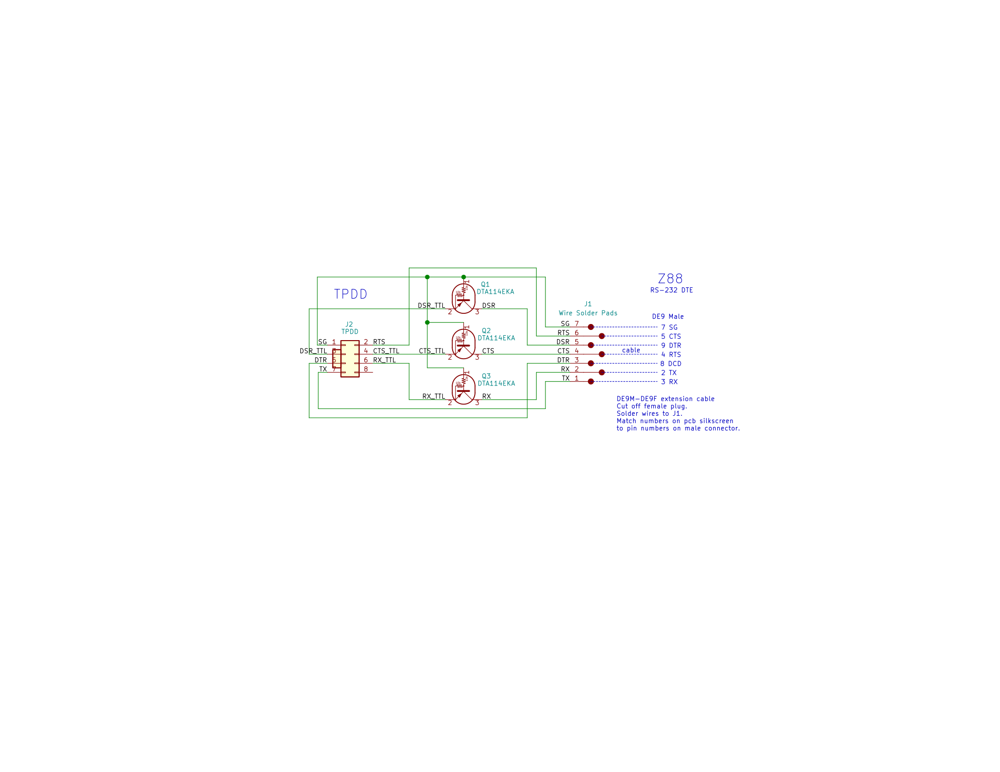

# TPDD_Cable

TTL-RS232 level-shifting cable for Tandy Portable Disk Drive

<http://tandy.wiki/TPDD>

# Alternative version for Cambridge Z88

# Credits/History
In the beginning, there was the [Marty Goodman Document](http://www.club100.org/library/ups/tpdd.do), and it was good.
<!-- ftp://salsa.net/pub/M100SIG/Lib-09-PERIFERALS/TPDD.DO -->

More recently, Rick Shear has taken a new and very careful look at a real cable, and the Marty Goodman doc, and has probably identified the "mystery" components that Marty Goodman talks about. It looks right, and this circuit does indeed work. 
[Rick's initial post](https://rsmicro.wordpress.com/2018/08/26/tpdd-cable/) 
[Rick's follow-up](https://rsmicro.wordpress.com/2018/09/08/built-tpdd-cable-comparison-to-oem/)

This cable uses the same transistors, but a different physical construction.
