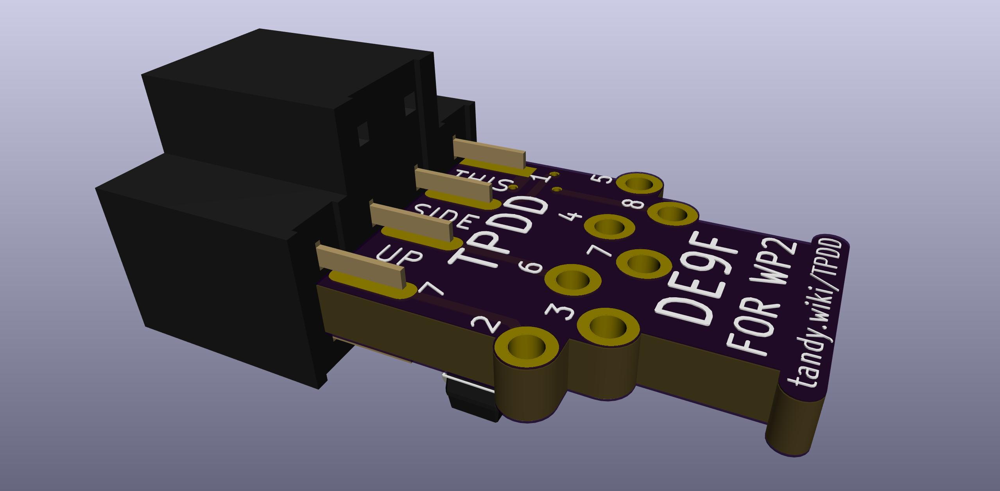
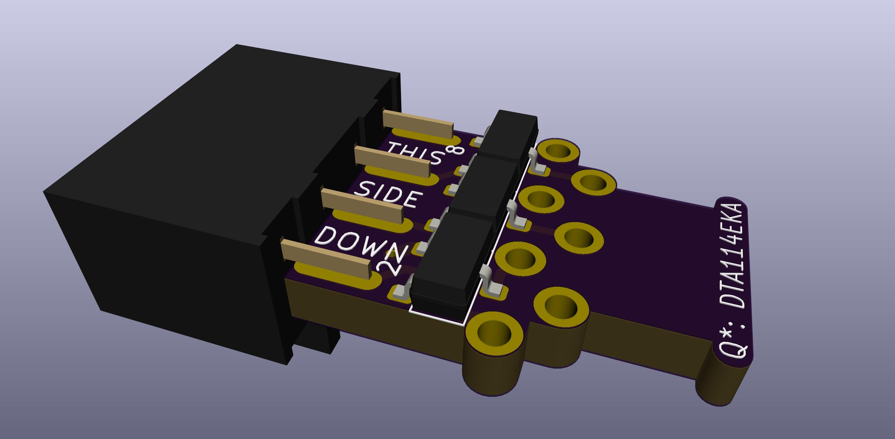
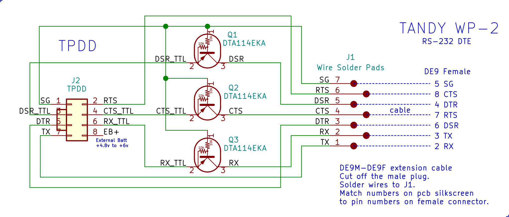
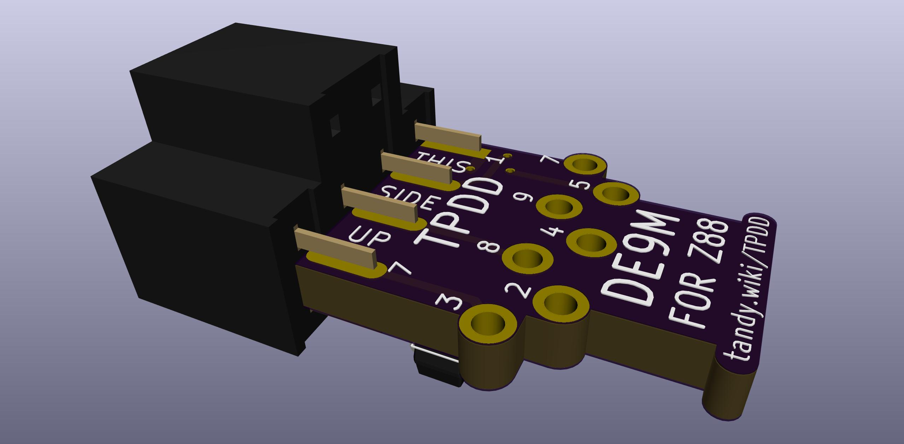
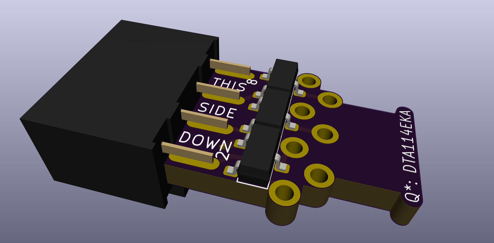

# TPDD_Cable

TTL-RS232 level-shifting cable for Tandy Portable Disk Drive

This version has a cable that ends in a male 25-pin plug to connect to a "Model T"s female 25-pin DTE RS-232 port.  
This is the same as the original cable that came with the drive.

Assembly pictures: <http://tandy.wiki/TPDD#Cable>

# Alternate Versions
There are a few other versions of the PCB for other machines, but the only difference is the silkscreen. In all cases it's the same circuit and the same connector on the drive end, with different plugs and pinouts on the computer end, and different silkscreen text to show different connector types and pin numbers. You could actually use the same standard PCB for any machine, just ignore the silkscreen and solder the kind of cable you need with the pinout you need.

## For TANDY WP-2 and most modern PCs and usb-serial adapters

The only difference to this version is the cable ends in a 9-pin female plug to connect to a 9-pin male DTE RS-232 port.  
This fits the TANDY WP-2, and also most modern PCs and usb-serial adapters.

## Version for Cambridge Z88

The only difference to this version is the cable ends in a 9-pin male plug with custom pinout.  
This fits the Cambridge Z88.  
*The Cambridge Z88 RS-232 port has a non-standard pinout.*
*Do not connect this cable to anything but a Cambridge Z88.*

# Credits / History
In the beginning, there was the [Marty Goodman Document](http://www.club100.org/library/ups/tpdd.do), and it was good.
<!-- ftp://salsa.net/pub/M100SIG/Lib-09-PERIFERALS/TPDD.DO -->

More recently, Rick Shear has taken a new and very careful look at a real cable, and the Marty Goodman doc, and has probably identified the "mystery" components that Marty Goodman talks about. It looks right, and the circuit does indeed work. 
[Rick's initial post](https://rsmicro.wordpress.com/2018/08/26/tpdd-cable/) 
[Rick's follow-up](https://rsmicro.wordpress.com/2018/09/08/built-tpdd-cable-comparison-to-oem/)

This cable uses the same transistors, but a different physical construction.
