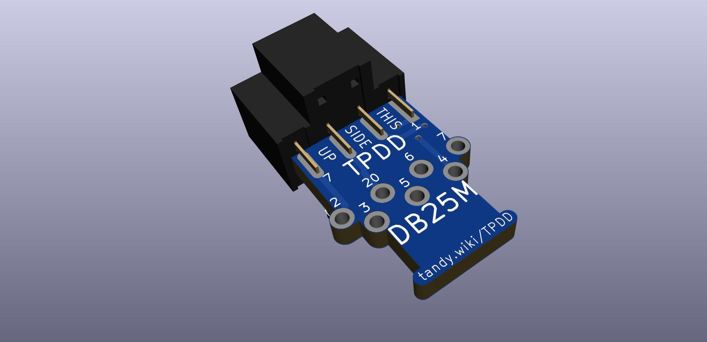
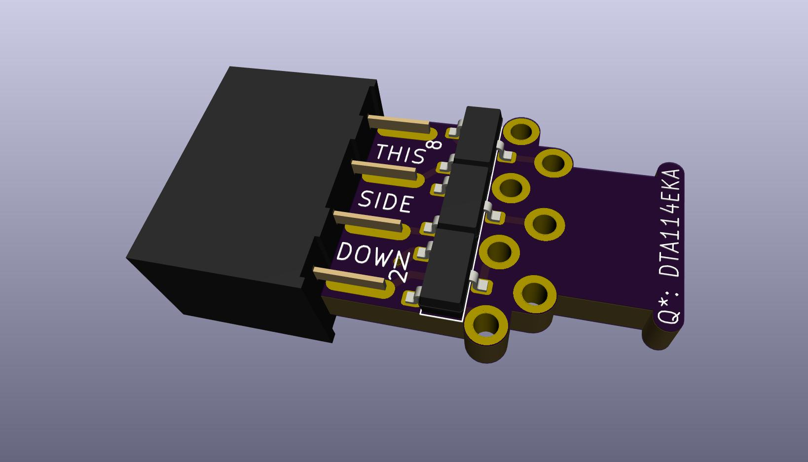
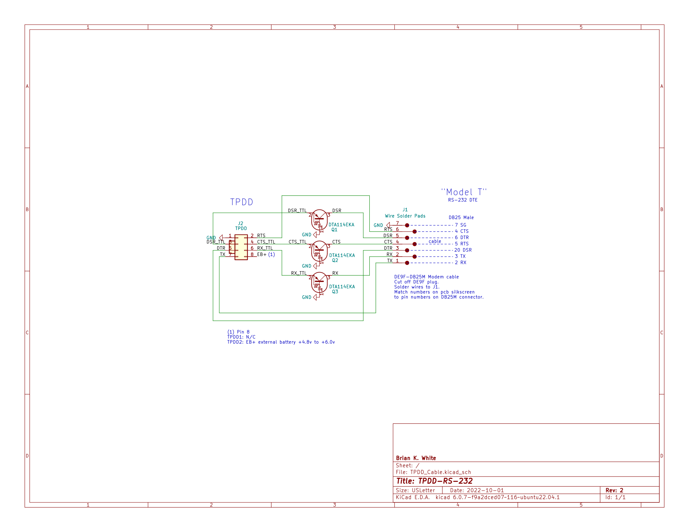

# TPDD_Cable

TTL-RS232 level-shifting cable for Tandy Portable Disk Drive

The cable ends in a male 25-pin plug to connect to the female 25-pin DTE RS-232 port on a "Model T" computer (Kyotronic KC-85, TRS-80 Model 100, TANDY Model 102 200 600, NEC PC-8201 PC-8300 PC-8401 PC-8500, Olivettin M10).  
This is the same arrangement as the original cable that came with the drive.

# Parts
PCB: [OSHPark](https://oshpark.com/shared_projects/Vseg3jxr) or [PCBWAY](https://www.pcbway.com/project/shareproject/TANDY_Portable_Disk_Drive_Cable.html)

[BOM](https://www.digikey.com/short/pbc3pp)  

You will also need:
* double-row 2.5mm male pin header, any length 2x4 or longer (used as an alignment/holder tool while soldering)
* 3/4" length of 1/4" diameter heat-shrink
* 1 1/2" length of 3/8" diameter heat-shrink
* one 0.1" x 4" / 3mm x 100mm zip-tie
* optionally, hot glue

The BOM includes a grey cable. If you would like a black cable instead, you can replace the cable in the cart with [this one](https://www.digikey.com/short/wbpp81nt).

# Directions

Solder the 3 transistors onto the pcb first.

Next place the pin sockets onto the male pin header in a 2-6-2 arrangement and pull the two un-used pins out of the 2x3 socket, to match the pictures above and below.

Solder the pcb to the socket pins with the transistors facing DOWN and the pin sockets polarity bump facing UP. Again see the pictures.

Assembly pictures: <http://tandy.wiki/TPDD#Cable>

Lastly solder the wires to the pcb following one of the tables below.

# Wiring
This is the normal wiring for connecting to a "Model T" computer, the same as the original cable that came with the drive.  
This is the wiring that the silkscreen right on the PCB describes, so this table is somewhat redundant. IE, pad #20 goes to DB25M pin #20.  

Cut the the cable either exactly in half to keep the un-used connector for something else, or cut off the un-used connector to make one longer cable.

Cut the jacket back about 1 to 1.5 inches to expose about 1 to 1.5 inches of inner wires.

Use a multimeter continuity tester to identify which color wires go to which pins on the DB25M connector.

Cut the un-used wires short, flush with the outer jacket insulation, and cover the end of the jacket insulation with a short 3/4" to 1" length of 1/4" heat-shrink. You don't need to insulate each individual wire, just prevent the un-insulated shield ground wire and the ends of the other wires from touching any part of the PCB. Have the heat-shrink end only about 1/8" beyond the end of the jacket. It needs to cover the cut wire ends, but not be any longer than necessary to do that. Later the cable end will need to be zip-tied to the pcb and the jacket end will need to be able to go up past the zip-tie area.

Put a 1 1/2" length of 3/8" heat-shrink on the cable for later.

Strip about 1/8" of insulation from all the remaining wires.

For convenience, the table below shows the colors for a couple of specific cables from DigiKey (The grey cable and a black cables from the BOM links above). If you buy one of the same cables, then your cable should have the same mapping. But don't trust it without verifying.

<table>
<tr><td rowspan="0"></td><th>Signal</th><th>PCB pad</th><th>DB25M pin</th><th>Signal</th><th><a href="https://www.digikey.com/short/w8zz83q5">GREY CABLE</a></th><th><a href="https://www.digikey.com/short/wbpp81nt">BLACK CABLE</a></th><td rowspan="0"></td></tr>
<tr><td>GND</td><td>7</td><td>7</td><td>GND</td><td>Green</td><td>Yellow</td></tr>
<tr><td>RTS</td><td>4</td><td>4</td><td>CTS</td><td>Purple</td><td>Blue</td></tr>
<tr><td>DSR</td><td>6</td><td>6</td><td>DTR</td><td>Blue</td><td>Green</td></tr>
<tr><td>CTS</td><td>5</td><td>5</td><td>RTS</td><td>Grey</td><td>Purple</td></tr>
<tr><td>DTR</td><td>20</td><td>20</td><td>DSR</td><td>Yellow</td><td>Orange</td></tr>
<tr><td>RXD</td><td>3</td><td>3</td><td>TXD</td><td>Red</td><td>Brown</td></tr>
<tr><td>TXD</td><td>2</td><td>2</td><td>RXD</td><td>Orange</td><td>Red</td></tr>
</table>

Solder the wires on the bottom side of the pcb, the side with the transistors.  
Flush-cut the opposite side after soldering and briefly touch each cut wire-end with the soldering iron to re-melt the solder into a smooth dome.  

Place the end of the cable on the top side of the PCB, and zip-tie the cable to the pcb. Make sure the zip-tie knot is on the top side of the pcb so that the heat-shrink will be able to slide over the end later. Ideally, add some hot-glue first, and add more to the other side to immobilize the wires where they enter to the pcb.

Slide the heat-shrink over the cable end, up to the back of the connector but not over it. It's a tight fit but the heat-shrink can be worked over the zip-tie knot but just rubbing and pushing. If the bulge is really too big, put a small amount of alcohol on the knot and then the heat-shrink can be slid right over.

# Alternate Wiring
There are a few other machines besides "Model T"'s that can use a TPDD, but their serial ports are different and usually need one or more adapters to work with the normal TPDD cable.
 
You can make a custom cable to connect to other kinds of machines by just ignoring the silkscreen on the PCB and use one the following wiring tables instead.

## For TANDY WP-2, most modern PCs, most usb-serial adapters, and anything else with a DE9M DTE port.
You need a cable with a DE9F on the end instead of DB25M.  
The cable in the BOM has both a DB25M on one end and a DE9F on the other end, so you can use the same BOM to make either a "Model T" cable or a PC cable, or cut the cable exactly in half and make one of each. Also true for the grey and black cable links in the table above.

The numbers next to the wire solder pads on the PCB normally indicate the pin# on a DB25M to connect to that pad.  
In this case ignore the meaning of the numbers and just treat them as arbitrary labels.  
<table>
<tr><td rowspan="0"></td><th>Signal</th><th>PCB pad</th><th>DE9M pin</th><th>Signal</th><td rowspan="0"></td></tr>
<tr><td>GND</td><td>7</td><td>5</td><td>GND</td></tr>
<tr><td>RTS</td><td>4</td><td>8</td><td>CTS</td></tr>
<tr><td>DSR</td><td>6</td><td>4</td><td>DTR</td></tr>
<tr><td>CTS</td><td>5</td><td>7</td><td>RTS</td></tr>
<tr><td>DTR</td><td>20</td><td>6</td><td>DSR</td></tr>
<tr><td>RXD</td><td>3</td><td>3</td><td>TXD</td></tr>
<tr><td>TXD</td><td>2</td><td>2</td><td>RXD</td></tr>
</table>

## For Cambridge Z88
*The Cambridge Z88 RS-232 port has a non-standard pinout.*  
*Do not connect this cable to anything but a Cambridge Z88.*

You need a different cable than what's in the BOM links. You need a cable with a DE9M on one end.
Delete the cable in the pre-loaded cart, search for "AE9869-ND" and add that instead.  
<table>
<tr><td rowspan="0"></td><th>Signal</th><th>PCB pad</th><th>DE9M pin</th><th>Signal</th><td rowspan="0"></td></tr>
<tr><td>GND</td><td>7</td><td>7</td><td>GND</td></tr>
<tr><td>RTS</td><td>4</td><td>5</td><td>CTS</td></tr>
<tr><td>DSR</td><td>6</td><td>9</td><td>DTR</td></tr>
<tr><td>CTS</td><td>5</td><td>4</td><td>RTS</td></tr>
<tr><td>DTR</td><td>20</td><td>8</td><td>DSR</td></tr>
<tr><td>RXD</td><td>3</td><td>2</td><td>TXD</td></tr>
<tr><td>TXD</td><td>2</td><td>3</td><td>RXD</td></tr>
</table>

# Credits / History
In the beginning, there was the [Marty Goodman Document](http://www.club100.org/library/ups/tpdd.do), and it was good.
<!-- ftp://salsa.net/pub/M100SIG/Lib-09-PERIFERALS/TPDD.DO -->

More recently, Rick Shear has taken a new and very careful look at a real cable, and the Marty Goodman doc, and has probably identified the "mystery" components that Marty Goodman talks about. It looks right, and the circuit does indeed work. 
[Rick's initial post](https://rsmicro.wordpress.com/2018/08/26/tpdd-cable/) 
[Rick's follow-up](https://rsmicro.wordpress.com/2018/09/08/built-tpdd-cable-comparison-to-oem/)

This cable uses the same transistors, but a different physical construction.
