# Cable for [Tandy Portable Disk Drive](http://tandy.wiki/TPDD)
(and TPDD2)

<!--
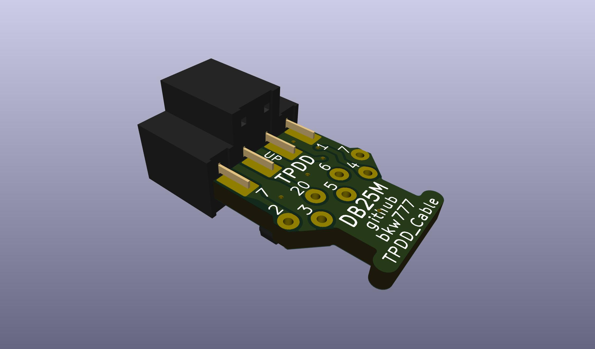

-->
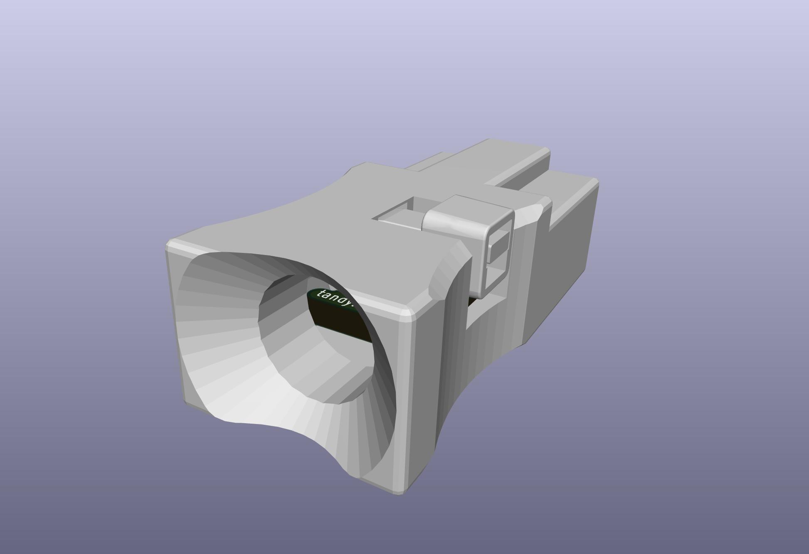
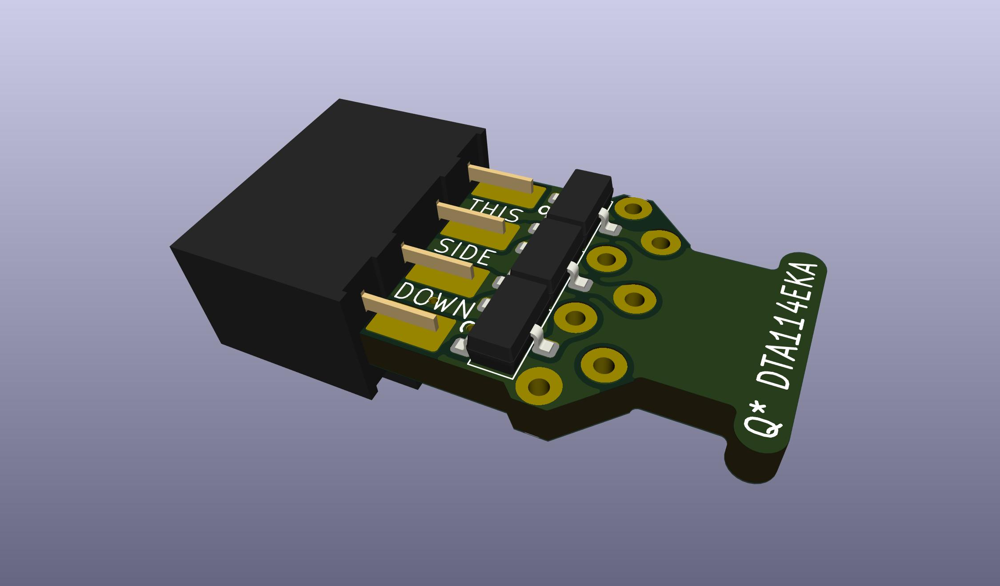
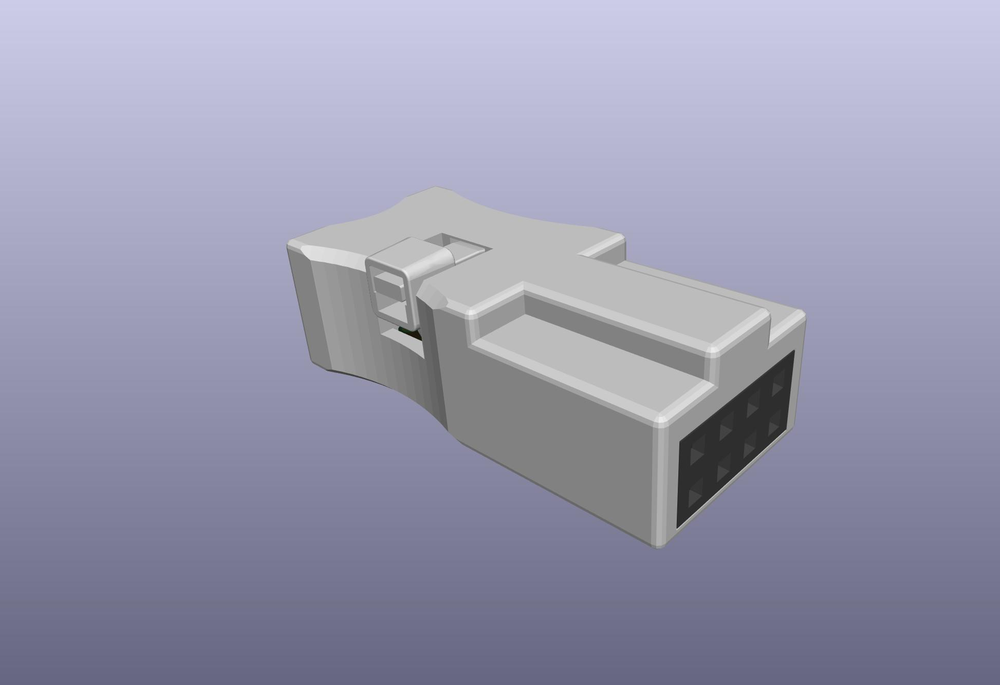
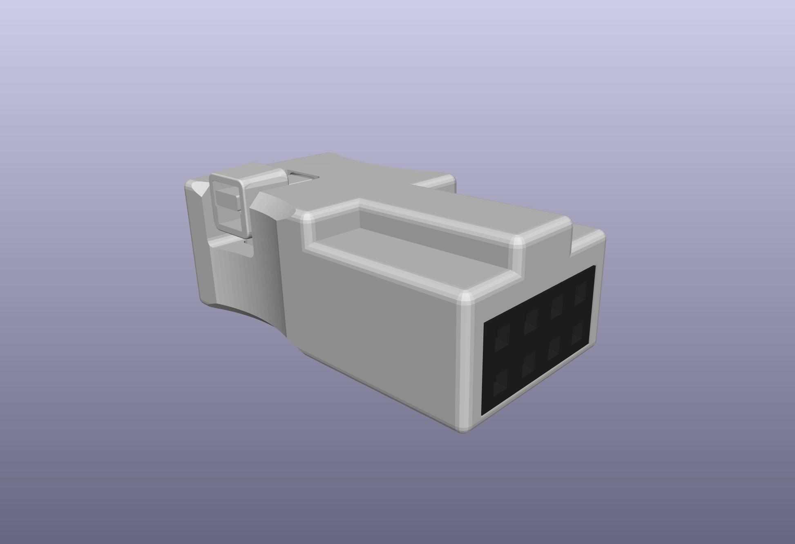
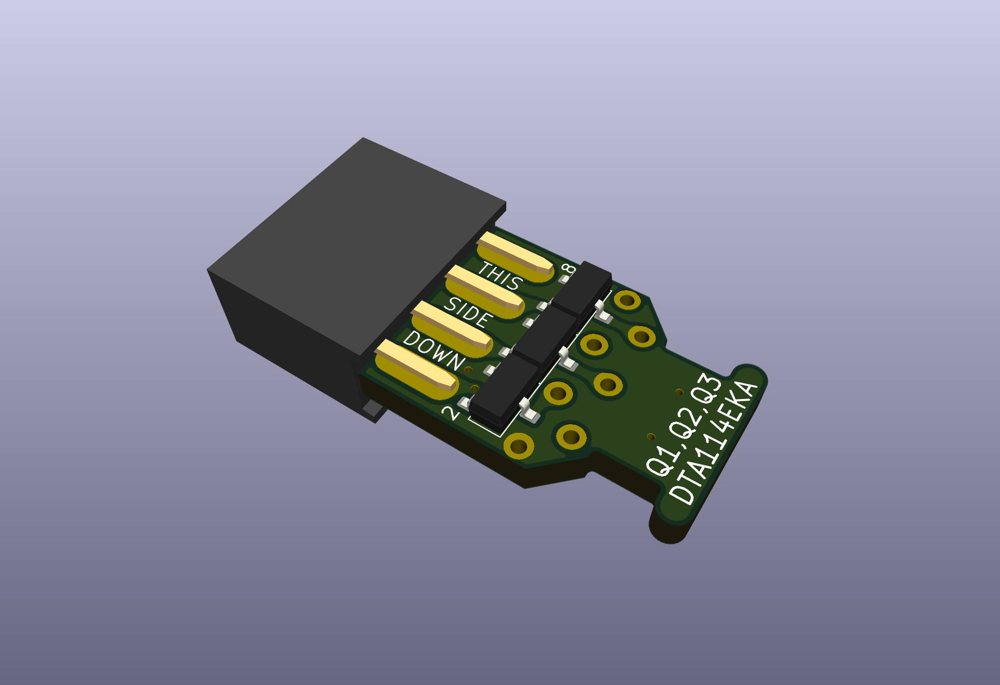
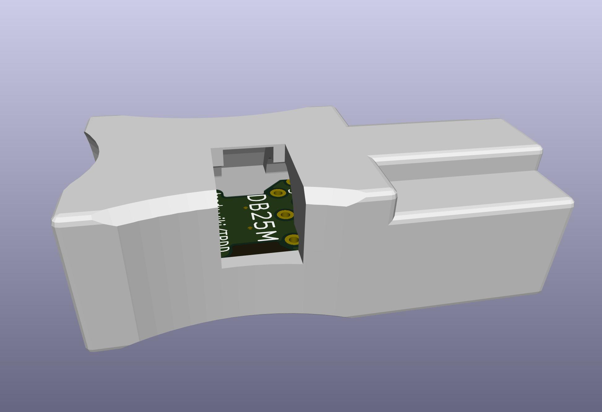
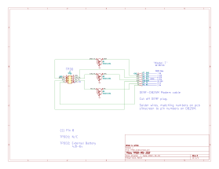
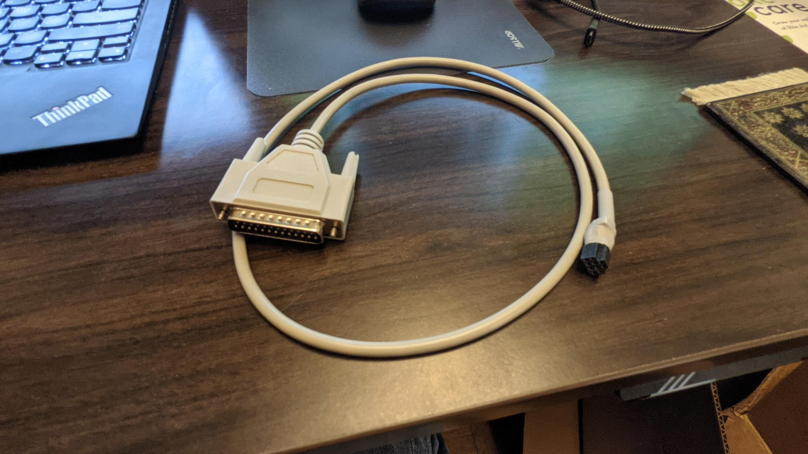
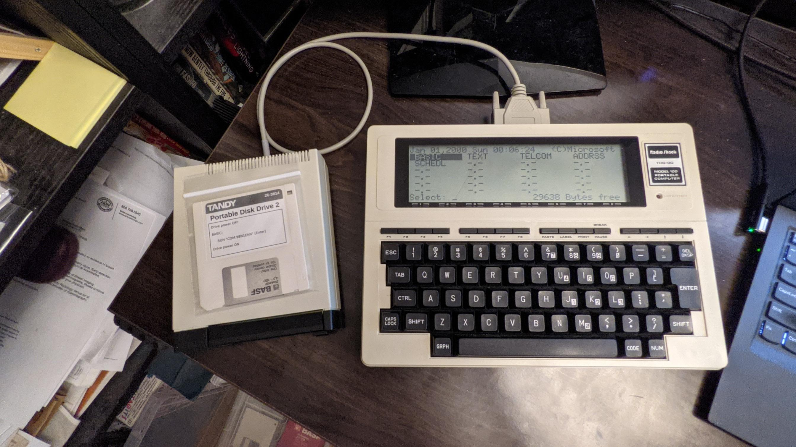
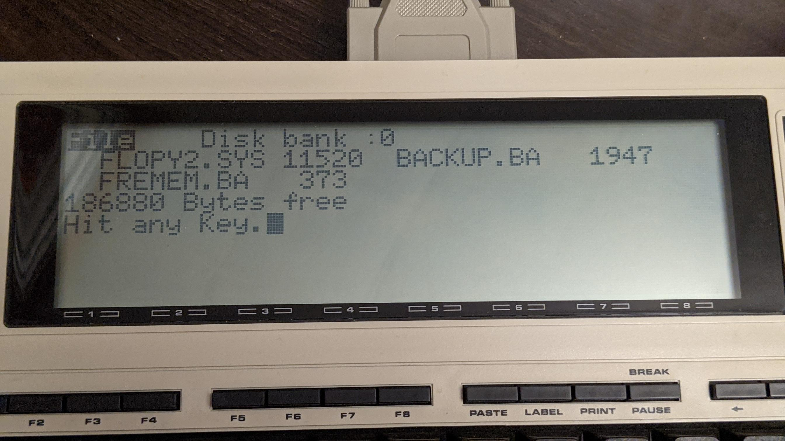

# Parts
PCB: [OSHPark](https://oshpark.com/shared_projects/Vseg3jxr) or [PCBWAY](https://www.pcbway.com/project/shareproject/TANDY_Portable_Disk_Drive_Cable.html)  
BOM: [DigiKey](https://www.digikey.com/short/chqvhvb7)  

also:
* 20-40mm of 6mm heat-shrink
* M3 cable tie

The BOM includes a grey cable. This [black cable](https://www.digikey.com/short/wbpp81nt) can be substituted if you want.

If using Elecrow, PCBWAY, or JLCPCB, you can upload the [housing STL file](HOUSING/TPDD_Cable_Housing.stl) to have it printed at the same time as the PCBs are being made. Choose nylon/PA11/PA12 material, SLS or MJF print method.
The model source SCAD file has a variable parameter for fitment clearance, and the STL file was generated with a fitment clearance setting of 0.1mm, which is suitable for high accuracy printing like SLS.  
If you want to try to print the part at home with an FDM printer, then open the scad file in openscad and change `fc=0.1;` to `fc=0.2;` and export a new stl.  

# Directions

Assembly pictures: <https://photos.app.goo.gl/TdYxGhzK94KT9rS78>
(old method before the 3d-printed housing)

If you want to make 2 cables, one for "Model T" clones and one for PC & WP-2, then cut the cable in half in the middle. (and buy double the transistors and connectors)  
Otherwise just cut the 9-pn plug off the cable to make one longer cable for Model 100 & clones.

## prepare the cable
Strip about 40-50mm of the the cable jacket.  
Strip about 4mm of each wire.  
Use a DMM in continuity mode to identify which color wires go to which pin numbers on the DB25M connector.  
The table should be correct for the exact cables linked here, but verify it before soldering.  
Otherwise, fill in your own table like the ones below for your particular cable.  
Cut the unused wires as short. (anything not mentioned in the tables below)  
Thread the 3d-printed housing onto the cable, with the rectangular opening facing the cut end of the cable.  
Thread the heatshrink onto the cable.

## solder the pcb
Solder the center transistor first, then the left & right transistors to minimize alignment errors.  
Then solder the 2x4 connector.  
Solder the wires to the pcb, with the solder on the transistor side of the pcb and the wires on the other side. Consult one of the tables below, or the one you made yourself. If your cable has say, purple goes to pin# 20, then solder the purple wire to the pad labelled 20 on the PCB, etc.

## assemble the housing
Slide the heat-shrink up flush with the end of the end of the cable jacket and shrink it.  
Slide the housing up over the pcb. Make sure the transistors face down, and the polarity key points up.  
Push the cable into the pocket as far as possible. Make sure the jacket goes far enough in to be grabbed by the cable tie. It may require some "squishing" of the cable to fit.  
Insert a cable tie in the opening, flat side of the strap facing the cable, pointing straght down on the side with the opening. Push the tie down and in so that it fishes under the pcb, up the other side, back over the top, and back out the opening on top, and thread into the head.  
Seat the cable as far in as possible and cinch the cable tie tight. Flush-cut the cable tie at the head.

# Standard Wiring, for a "Model T", like the original cable
The standard version of the cable ends in a male 25-pin plug to connect to the female 25-pin DTE RS-232 port on any of the following machines:  
 Kyotronic KC-85  
 TRS-80/TANDY Model 100, 102, 200, 600  
 NEC PC-8201, PC-8300, PC-8401, PC-8500  
 Olivetti M10  
This is the same arrangement as the original cable that came with the drive.

This is the wiring that matches the numbers on the the silkscreen. IE, the via labelled 3 on the PCB goes to DB25M pin 3, via 20 goes to DB25M pin 20, and so on.

For convenience, the table below also shows the colors for a couple of specific cable options from DigiKey from the BOM links above. If you buy one of these exact specific cables, then your cable should match this table. But don't trust the colors without verifying. If you buy any other cable that isn't specifically exactly the one from one of these BOM links, then ignore the colors and map out your cable yourself to find out which color goes to DB25M pin 3 etc.

<table>
<tr>
<td rowspan="0">&nbsp;&nbsp;&nbsp;&nbsp;&nbsp;&nbsp;&nbsp;&nbsp;&nbsp;&nbsp;&nbsp;&nbsp;&nbsp;&nbsp;&nbsp;&nbsp;&nbsp;&nbsp;&nbsp;&nbsp;&nbsp;&nbsp;&nbsp;&nbsp;&nbsp;&nbsp;&nbsp;&nbsp;&nbsp;&nbsp;&nbsp;&nbsp;&nbsp;&nbsp;&nbsp;&nbsp;&nbsp;&nbsp;&nbsp;&nbsp; 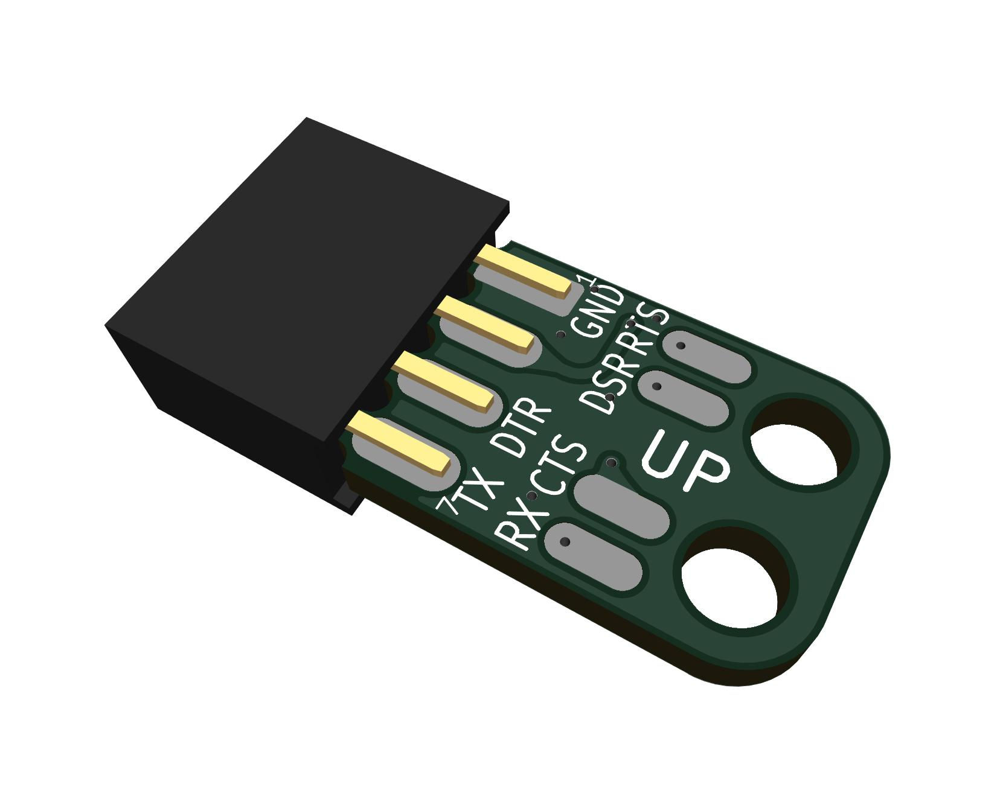 &nbsp;&nbsp;&nbsp;&nbsp;&nbsp;&nbsp;&nbsp;&nbsp;&nbsp;&nbsp;&nbsp;&nbsp;&nbsp;&nbsp;&nbsp;&nbsp;&nbsp;&nbsp;&nbsp;&nbsp;&nbsp;&nbsp;&nbsp;&nbsp;&nbsp;&nbsp;&nbsp;&nbsp;&nbsp;&nbsp;&nbsp;&nbsp;&nbsp;&nbsp;&nbsp;&nbsp;&nbsp;&nbsp;&nbsp;&nbsp;</td>

<th>Signal</th>
<th>PCB pad</th>
<th><a href="https://www.digikey.com/short/w8zz83q5">GREY CABLE</a></th>
<th><a href="https://www.digikey.com/short/wbpp81nt">BLACK CABLE</a></th>
<th>DB25M pin</th>
<th>Signal</th>

<td rowspan="0">&nbsp;&nbsp;&nbsp;&nbsp;&nbsp;&nbsp;&nbsp;&nbsp;&nbsp;&nbsp;&nbsp;&nbsp;&nbsp;&nbsp;&nbsp;&nbsp;&nbsp;&nbsp;&nbsp;&nbsp;&nbsp;&nbsp;&nbsp;&nbsp;&nbsp;&nbsp;&nbsp;&nbsp;&nbsp;&nbsp;&nbsp;&nbsp;&nbsp;&nbsp;&nbsp;&nbsp;&nbsp;&nbsp;&nbsp;&nbsp;  &nbsp;&nbsp;&nbsp;&nbsp;&nbsp;&nbsp;&nbsp;&nbsp;&nbsp;&nbsp;&nbsp;&nbsp;&nbsp;&nbsp;&nbsp;&nbsp;&nbsp;&nbsp;&nbsp;&nbsp;&nbsp;&nbsp;&nbsp;&nbsp;&nbsp;&nbsp;&nbsp;&nbsp;&nbsp;&nbsp;&nbsp;&nbsp;&nbsp;&nbsp;&nbsp;&nbsp;&nbsp;&nbsp;&nbsp;&nbsp;</td>
</tr>

<tr><td>GND</td><td>7</td><td>Green</td><td>Yellow</td><td>7</td><td>GND</td></tr>
<tr><td>RTS</td><td>4</td><td>Purple</td><td>Blue</td><td>4</td><td>CTS</td></tr>
<tr><td>DSR</td><td>6</td><td>Blue</td><td>Green</td><td>6</td><td>DTR</td></tr>
<tr><td>CTS</td><td>5</td><td>Grey</td><td>Purple</td><td>5</td><td>RTS</td></tr>
<tr><td>DTR</td><td>20</td><td>Yellow</td><td>Orange</td><td>20</td><td>DSR</td></tr>
<tr><td>RXD</td><td>3</td><td>Red</td><td>Brown</td><td>3</td><td>TXD</td></tr>
<tr><td>TXD</td><td>2</td><td>Orange</td><td>Red</td><td>2</td><td>RXD</td></tr>
</table>

To verify the final result, check the following with a DMM in Continuity and Diode modes.

<table>
<tr><td rowspan="0">&nbsp;&nbsp;&nbsp;&nbsp;&nbsp;&nbsp;&nbsp;&nbsp;&nbsp;&nbsp;&nbsp;&nbsp;&nbsp;&nbsp;&nbsp;&nbsp;&nbsp;&nbsp;&nbsp;&nbsp; 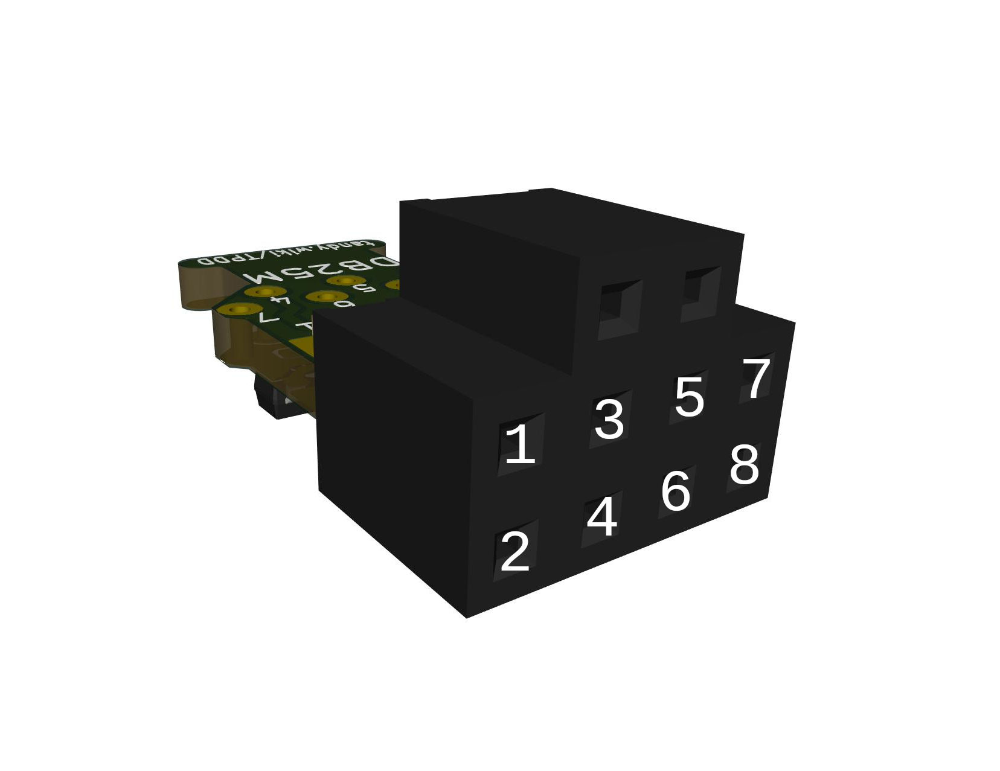 &nbsp;&nbsp;&nbsp;&nbsp;&nbsp;&nbsp;&nbsp;&nbsp;&nbsp;&nbsp;&nbsp;&nbsp;&nbsp;&nbsp;&nbsp;&nbsp;&nbsp;&nbsp;&nbsp;&nbsp;</td><th>BLACK</th><th>CONT</th><th>DIODE</th><th>RED</th><td rowspan="0">&nbsp;&nbsp;&nbsp;&nbsp;&nbsp;&nbsp;&nbsp;&nbsp;&nbsp;&nbsp;&nbsp;&nbsp;&nbsp;&nbsp;&nbsp;&nbsp;&nbsp;&nbsp;&nbsp;&nbsp;  &nbsp;&nbsp;&nbsp;&nbsp;&nbsp;&nbsp;&nbsp;&nbsp;&nbsp;&nbsp;&nbsp;&nbsp;&nbsp;&nbsp;&nbsp;&nbsp;&nbsp;&nbsp;&nbsp;&nbsp;</td></tr>
<tr><td>1</td><td>BEEP</td><td></td><td>7</td></tr>
<tr><td>2</td><td>BEEP</td><td></td><td>4</td></tr>
<tr><td>3</td><td></td><td>1.7v</td><td>6</td></tr>
<tr><td>4</td><td></td><td>1.7v</td><td>5</td></tr>
<tr><td>5</td><td>BEEP</td><td></td><td>20</td></tr>
<tr><td>6</td><td></td><td>1.7v</td><td>3</td></tr>
<tr><td>7</td><td>BEEP</td><td></td><td>2</td></tr>
</table>

Solder the wires on the bottom side of the pcb, with the wire on same side with the transistors, the cut ends on the top side without the transistors.  

Flush-cut the top side after soldering, and re-melt each wire end into a smooth dome that won't pierce wire insulation.

Lay the wires down flat on the bottom side of the pcb, pulled away from the connector, and cover the ends of the wires with hot-glue to keep them from flexing at the solder joint.

Hot-glue the end of the cable on the top side of the PCB, and zip-tie the cable to the pcb.  
Make sure the zip-tie knot is on the top side of the pcb to the left or right, so that the heat-shrink will be able to get over the bulge. It's a tight fit, but the heat-shrink can be worked over the knot usually.

Slide the heat-shrink over the cable end, up to the back of the connector but not over it. It's a tight fit but the heat-shrink can be worked over the zip-tie knot by just rubbing and pushing repeatedly, and it works a little further along each time. If the bulge is really too big, put a small amount of distilled water or alcohol on the knot and then the heat-shrink can be slid right over. (If you use alcohol, then you may want to heat the whole area for an extra long time when shrinking the heat-shrink, to re-melt the hot-glue, because alcohol seperates hot-glue surface bonds.)

# Alternate Wiring
Other machines besides "Model T"'s like the TRS-80 Model 100 can use a TPDD, but their serial ports are different and usually need one or more adapters to work with the 25-pin cable for Model 100/200.
 
You can make a custom cable that will need no adapters to connect to other kinds of machines by just ignoring the silkscreen on the PCB and use one the following wiring tables instead of the standard wiring table above.

## PC / TANDY WP-2 / Atari Portfolio
For Modern PCs and usb-serial adapters, TANDY WP-2, Atari Portfolio, and anything else with a standard DE9M DTE port.  
You need a cable with a DE9F on the end instead of DB25M.  
The cable in the BOM has both a DB25M on one end and a DE9F on the other end, so you can use the same BOM to make either a "Model T" cable, or a PC cable, or both.

The numbers next to the wire solder pads on the PCB normally indicate the pin# on a DB25M to connect to that pad.  
In this case ignore that original meaning and just treat the numbers as arbitrary identifiers. IE, PCB pad #3 is just pad #3, not DB25M pin #3 in this case. Use the table below to find what DE9F pin # each pad should connect to.  
<table>
<tr><td rowspan="0">&nbsp;&nbsp;&nbsp;&nbsp;&nbsp;&nbsp;&nbsp;&nbsp;&nbsp;&nbsp;&nbsp;&nbsp;&nbsp;&nbsp;&nbsp;&nbsp;&nbsp;&nbsp;&nbsp;&nbsp;  &nbsp;&nbsp;&nbsp;&nbsp;&nbsp;&nbsp;&nbsp;&nbsp;&nbsp;&nbsp;&nbsp;&nbsp;&nbsp;&nbsp;&nbsp;&nbsp;&nbsp;&nbsp;&nbsp;&nbsp;</td><th>Signal</th><th>PCB pad</th><th>DE9F pin</th><th>Signal</th><td rowspan="0">&nbsp;&nbsp;&nbsp;&nbsp;&nbsp;&nbsp;&nbsp;&nbsp;&nbsp;&nbsp;&nbsp;&nbsp;&nbsp;&nbsp;&nbsp;&nbsp;&nbsp;&nbsp;&nbsp;&nbsp; 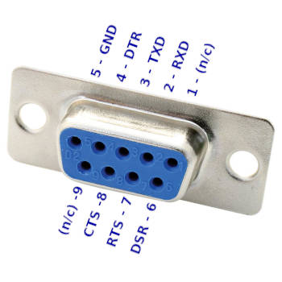 &nbsp;&nbsp;&nbsp;&nbsp;&nbsp;&nbsp;&nbsp;&nbsp;&nbsp;&nbsp;&nbsp;&nbsp;&nbsp;&nbsp;&nbsp;&nbsp;&nbsp;&nbsp;&nbsp;&nbsp;</td></tr>
<tr><td>GND</td><td>7</td><td>5</td><td>GND</td></tr>
<tr><td>RTS</td><td>4</td><td>8</td><td>CTS</td></tr>
<tr><td>DSR</td><td>6</td><td>4</td><td>DTR</td></tr>
<tr><td>CTS</td><td>5</td><td>7</td><td>RTS</td></tr>
<tr><td>DTR</td><td>20</td><td>6</td><td>DSR</td></tr>
<tr><td>RXD</td><td>3</td><td>3</td><td>TXD</td></tr>
<tr><td>TXD</td><td>2</td><td>2</td><td>RXD</td></tr>
</table>

To verify the final result, check the following with a DMM in Continuity and Diode modes.

<table>
<tr><td rowspan="0">&nbsp;&nbsp;&nbsp;&nbsp;&nbsp;&nbsp;&nbsp;&nbsp;&nbsp;&nbsp;&nbsp;&nbsp;&nbsp;&nbsp;&nbsp;&nbsp;&nbsp;&nbsp;&nbsp;&nbsp;  &nbsp;&nbsp;&nbsp;&nbsp;&nbsp;&nbsp;&nbsp;&nbsp;&nbsp;&nbsp;&nbsp;&nbsp;&nbsp;&nbsp;&nbsp;&nbsp;&nbsp;&nbsp;&nbsp;&nbsp;</td><th>BLACK</th><th>CONT</th><th>DIODE</th><th>RED</th><td rowspan="0">&nbsp;&nbsp;&nbsp;&nbsp;&nbsp;&nbsp;&nbsp;&nbsp;&nbsp;&nbsp;&nbsp;&nbsp;&nbsp;&nbsp;&nbsp;&nbsp;&nbsp;&nbsp;&nbsp;&nbsp;  &nbsp;&nbsp;&nbsp;&nbsp;&nbsp;&nbsp;&nbsp;&nbsp;&nbsp;&nbsp;&nbsp;&nbsp;&nbsp;&nbsp;&nbsp;&nbsp;&nbsp;&nbsp;&nbsp;&nbsp;</td></tr>
<tr><td>1</td><td>BEEP</td><td></td><td>5</td></tr>
<tr><td>2</td><td>BEEP</td><td></td><td>7</td></tr>
<tr><td>3</td><td></td><td>1.7v</td><td>6</td></tr>
<tr><td>4</td><td></td><td>1.7v</td><td>8</td></tr>
<tr><td>5</td><td>BEEP</td><td></td><td>4</td></tr>
<tr><td>6</td><td></td><td>1.7v</td><td>2</td></tr>
<tr><td>7</td><td>BEEP</td><td></td><td>3</td></tr>
</table>

## Cambridge Z88
*The Cambridge Z88 RS-232 port has a non-standard pinout.*  
*Do not connect this cable to anything but a Cambridge Z88.*

You need a different cable than what's in the BOM links above.  
Delete the cable in the pre-loaded cart, and add [this one](https://www.digikey.com/short/mrf9n7nh) instead.  
<table>
<tr><td rowspan="0">&nbsp;&nbsp;&nbsp;&nbsp;&nbsp;&nbsp;&nbsp;&nbsp;&nbsp;&nbsp;&nbsp;&nbsp;&nbsp;&nbsp;&nbsp;&nbsp;&nbsp;&nbsp;&nbsp;&nbsp;  &nbsp;&nbsp;&nbsp;&nbsp;&nbsp;&nbsp;&nbsp;&nbsp;&nbsp;&nbsp;&nbsp;&nbsp;&nbsp;&nbsp;&nbsp;&nbsp;&nbsp;&nbsp;&nbsp;&nbsp;</td><th>Signal</th><th>PCB pad</th><th>DE9M pin</th><th>Signal</th><td rowspan="0">&nbsp;&nbsp;&nbsp;&nbsp;&nbsp;&nbsp;&nbsp;&nbsp;&nbsp;&nbsp;&nbsp;&nbsp;&nbsp;&nbsp;&nbsp;&nbsp;&nbsp;&nbsp;&nbsp;&nbsp; 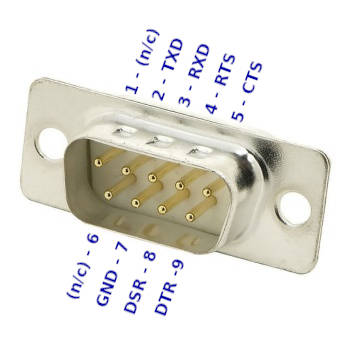 &nbsp;&nbsp;&nbsp;&nbsp;&nbsp;&nbsp;&nbsp;&nbsp;&nbsp;&nbsp;&nbsp;&nbsp;&nbsp;&nbsp;&nbsp;&nbsp;&nbsp;&nbsp;&nbsp;&nbsp;</td></tr>
<tr><td>GND</td><td>7</td><td>7</td><td>GND</td></tr>
<tr><td>RTS</td><td>4</td><td>5</td><td>CTS</td></tr>
<tr><td>DSR</td><td>6</td><td>9</td><td>DTR</td></tr>
<tr><td>CTS</td><td>5</td><td>4</td><td>RTS</td></tr>
<tr><td>DTR</td><td>20</td><td>8</td><td>DSR</td></tr>
<tr><td>RXD</td><td>3</td><td>2</td><td>TXD</td></tr>
<tr><td>TXD</td><td>2</td><td>3</td><td>RXD</td></tr>
</table>

# Alternate "PITA" pcb
**TPDD_Cable_PITA** is a version of the cable that uses a PCB that goes into a DB25 backshell instead of a tiny pcb on the TPDD end of the cable, and a "dupont" style connector is used for the TPDD end.

It's called "PITA" because making the dupont end of the cable is a pain in the ass. All in all, the PITA version requires more parts, more tools, and more steps, ... but LESS skill. So if the tiny pcb looks intimidating, or if it's confusing about which wires need to go to which numbers on the tiny pcb, the PITA version is simpler and easier on both counts.

The PITA version BOM.csv specifies a particular model/design of backshell for a reason. The common grey backshell like in Rick Shear's original version below, and almost all other backshell models, actually interferes with the case on the Model 100 and prevents the connector from inserting all the way. Molded cables and this particular backshell don't interfere and they insert all the way.

# Credits / History
In the beginning, there was the [Marty Goodman Document](https://raw.githubusercontent.com/LivingM100SIG/Living_M100SIG/main/M100SIG/Lib-09-PERIFERALS/TPDD.DO), and it was good.

More recently, Rick Shear has taken a new and very careful look at a real cable, and the Marty Goodman doc, and has probably identified the "mystery" components that Marty Goodman talks about. It looks right, and the circuit does indeed work.  
[Rick's initial post](https://rsmicro.wordpress.com/2018/08/26/tpdd-cable/)  
[Rick's follow-up](https://rsmicro.wordpress.com/2018/09/08/built-tpdd-cable-comparison-to-oem/)

This cable uses the same transistors, but a different physical construction.
