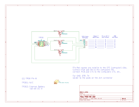
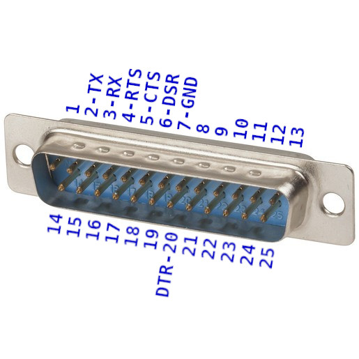

# Cable for [Tandy Portable Disk Drive](http://tandy.wiki/TPDD)

# Parts
PCB & Housing (and solder jig): [PCBWAY](https://www.pcbway.com/project/shareproject/TANDY_Portable_Disk_Drive_Cable.html)  
BOM: [DigiKey](https://www.digikey.com/short/87q1nv0f)  

The BOM includes a grey cable. This [black cable](https://www.digikey.com/short/wbpp81nt) can be substituted if you want.

# Directions

[pictures of build process](build_pics/build_pics.md)
<!--
Assembly pictures: <https://photos.app.goo.gl/TdYxGhzK94KT9rS78>
(old method before the 3d-printed housing)
-->

If you want to make 2 cables, one for Model 100 and one for PC/WP-2, then double the BOM components except for the cable, and cut the cable in half right in the middle.  
Otherwise just cut off the 9-pin plug to make one longer cable for Model 100 and other KC-85 clones.

## prepare the cable

Cut the unwanted plug off the cable.  
If building a Model 100 cable, cut off the 9-pin plug.  
If building a PC/WP-2 cable, cut off the 25-pin plug.  
If building both cables, cut the cable in half in the middle.

Strip off about 1 inch or 25mm of the cable jacket.  
Also cut the foil shield and the bare wire short right at the end of the jacket.

Apply a bit of flux to the ends of the loose wires.

Load up the soldering iron with a ball of solder and touch the soldering iron to the end of each wire long enough for the insulation to shrink itself back about 1-2mm and tin the end of the wire at the same time. You only need about 1mm of wire exposed and it's not worth trying to actually strip the insulation the normal way. Just heat the very tip end and it will melt and shrink itself back the perfect amount and the wire will end up tinned as well.

Insert the cable into the round opening on the housing and push the cable all the way through the housing and slide the housing about a foot back from the end of the cable.

Thread a 1 to 1-1/2 inch (25-30mm) piece of heatshrink onto the cable and slide back to the housing.  
Don't shrink it.

## Map the wire colors to the plug pin numbers

Print the wire color worksheet.

Put a DMM into continuity mode.

Use a jumper wire or meter lead with an alligator clip to grab one of the wires and connect to one lead of the DMM.

Probe with the other meter lead to touch each pin on the DB25 to find which pin that wire goes to.

Write the color of the wire for that pin number on the worksheet.

Repeat for all wires.

Cut the un-used wires short.
For the exact cable in the BOM, and most others, there will be 3 wires with no place on the PCB: a bare wire connected to both the DB25 shell and pin 1, a wire on pin 8, and a wire on pin 22.  
Cut all of those as short as possible right at the end of the cable jacket.

## solder the pcb
Solder the transistors onto the pcb.

Insert the pcb and the 2x4 connector into the solder jig.  
Face up or down doesn't matter.

Solder the 4 exposed pins on the 2x4 connector.

Remove the pcb from the jig and solder the other 4 pins on the 2x4 connector.

## solder the wires to the pcb
The signal names on the PCB are relative to the computer, aka the DTE side.  
Ex: The pad labelled RTS on the PCB connects to the computers RTS.

Follow your worksheet to match wire colors to the pads on the PCB.

Start with the cable pointing the "wrong" way on the pcb, with cut end pointing towards the zip tie end of the pcb, ie the opposite direction from how it must be in the end, and solder the 4 pads closest to the holes.

Then fold the cable over and solder the remaining 3 wires to pads on the 2x4 connector.

Wash all flux from the pcb and wires.

## assemble the housing
Slide the heat-shrink 2mm past the end of the end of the cable jacket, just enough to cover the unused cut wires and shielding, and shrink it. Don't leave any more heat shrink in front of the jacket than necessary, just enough to cover the cut wires. You need to push the cable into the plug body as far as possible later, and excess heat-shrink will prevent the cable from inserting as far.

Slide the housing up over the pcb, or in other words pull the pcb into the housing.  
The heat-shrink will want to catch on the front edge of the housing, so squeeze and twist to get the heat-shrink started into the rectangular opening at the front of the housing. If the housing still digs up the heat-shrink, you can usually smooth it back out by just heating it again.

**Make sure the transistors face DOWN, and the polarity key points UP**.

Once the pcb is all the way in, push the cable forward into the housing as far as possible.  
Make sure the jacket end goes past the cable tie area.

Use pliers to put a small extra bend at the very tip of the cable tie, in the same direction it's already bent (the direction it will bend to wrap around the cable).

Insert the zip tie from above down into the one exposed hole in the pcb you can see, and push in with pilers.

With some wiggling, the zip tie will thread itself under the pcb and back up the other side and come out the top.

Keep pushing the zip tie in a few mm at a time for the whole length of the zip tie. You won't be able to pull it from the top, you'll have to push it the whole way.

Once the tie is almost all the way in, you can thread the tip into the head and pull it most of the way but not all the way tight yet.

Push the head all the way down with the plier tips and wiggle/twist the cable a little to push the cable in as far as it can go before pulling the zip tie all the way tight.

The zip tie does double duty. It both clamps the cable to the pcb and also locks the pcb into the housing so it can't pull back out the front the same way it went in.

Once you have tested the cable and are sure the connections are correct, it would be best to inject some glue into the housing to immobilize the wires so they don't flex and break at the solder joints eventually, and to prevent the cable from pulling back out of the zip tie. Almost any kind will do. C-A glue (superglue), vynil glue (goop, e6000), hot glue gun, etc. 

# Cable Wiring Options

For convenience, the tables below show the wire colors for the specific cables linked here.  
If you buy one of these exact specific cables, then your cable should match one of the tables below, but still double-check the wire colors to pin numbers before soldering.

If you use any other cable that isn't specifically from one of the links here, then ignore the colors in the tables below and map out your cables wire colors yourself with a DMM continuity beeper and one of the printable worksheets below.

The grey cable in the BOM, and the alternative black cable, has both a DB25M on one end and a DE9F on the other end, so you can use the same BOM to make either a "Model T" cable, or a PC cable, or one of each if you double up the other components.

## DB25 Male cable for TRS-80 Model 100 and other KC-85 clones
This is the standard version of the cable that replicates the cable that originally shipped with the TPDD and TPDD2.

The cable in the BOM supports this option.

It supports at least the following machines:

<ul>
Kyotronic KC-85 
TRS-80/TANDY Model 100, 102, 200, 600 
NEC PC-8201, PC-8300, PC-8401, PC-8500 
Olivetti M10

Any other machine with a *female* DB25 DTE RS-232 port. The female part is unusual but some other early machines besides these did have it this way also.
</ul>

[PRINTABLE WIRE COLOR WORKSHEET for KC-85 CLONES](DB25M_DTE_Wire_Chart.pdf)

<table border=1 cellspacing=0>
<caption>TPDD to Model 100</caption>
<tr>
<th colspan=2 width=35%>PCB PAD</th>
<th><a href="https://www.digikey.com/short/w8zz83q5">GREY CABLE</a></th>
<th><a href="https://www.digikey.com/short/wbpp81nt">BLACK CABLE</a></th>
<th colspan=2 width=35%>DB25 PIN</th>
</tr>
<tr>
<td rowspan=99 cellpadding=0></td>
<td>TX</td>
<td>Orange</td>
<td>Red</td>
<td>2</td>
<td rowspan=99 cellpadding=0></td>
</tr>
<!--<tr><td>TX</td><td>Orange</td><td>Red</td><td>2</td></tr>-->
<tr><td>RX</td><td>Red</td><td>Brown</td><td>3</td></tr>
<tr><td>RTS</td><td>Purple</td><td>Blue</td><td>4</td></tr>
<tr><td>CTS</td><td>Grey</td><td>Purple</td><td>5</td></tr>
<tr><td>DSR</td><td>Blue</td><td>Green</td><td>6</td></tr>
<tr><td>GND</td><td>Green</td><td>Yellow</td><td>7</td></tr>
<tr><td>DTR</td><td>Yellow</td><td>Orange</td><td>20</td></tr>
</table>

To verify the final result, check the following with a DMM in Continuity and Diode modes.

<table border=1 cellspacing=0>
<tr>
<th rowspan=99 width=35%></th>
<th>BLACK</th><th>CONT</th><th>DIODE</th><th>RED</th>
<th rowspan=99 width=35%></th>
</tr>
<tr><td>1</td><td>BEEP</td><td></td><td>7</td></tr>
<tr><td>2</td><td>BEEP</td><td></td><td>4</td></tr>
<tr><td>3</td><td></td><td>1.7v</td><td>6</td></tr>
<tr><td>4</td><td></td><td>1.7v</td><td>5</td></tr>
<tr><td>5</td><td>BEEP</td><td></td><td>20</td></tr>
<tr><td>6</td><td></td><td>1.7v</td><td>3</td></tr>
<tr><td>7</td><td>BEEP</td><td></td><td>2</td></tr>
</table>

## DE9 Female cable for Standard PC 9-pin COM port
This version supports:
<ul>
Most PCs with 9-pin com ports 
usb-serial adapters 
TANDY WP-2 
Atari Portfolio 
Anything else with a standard male DE9 DTE RS-232 port
</ul>

IE this is for connecting the TPDD directly to a PC, which is not something you usually need to do.

This cable is useful for using [pdd.sh](https://githup.com/bkw777/pdd.sh) to take a raw disk image of a commercial disk or to re-create a disk from a disk image. You don't need this merely to copy normal files, but disks like the utility disks and the sardine dictionary disk are special and can't be copied any other way.

This is also useful if you have a Tandy WP-2 and want to use it's built-in TPDD support.

The cable in the BOM supports this option.

[PRINTABLE WIRE COLOR WORKSHEET for PC/WP-2](DE9F_DTE_Wire_Chart.pdf)

<table border=1 cellspacing=0>
<caption>TPDD to PC</caption>
<tr>
<th colspan=2 width=35%>PCB PAD</th>
<th colspan=2 width=35%>DE9 PIN</th>
</tr>
<tr>
<td rowspan=99 cellpadding=0></td>
<td>RX</td>
<td>2</td>
<td rowspan=99 cellpadding=0></td>
</tr>
<!--<tr><td>RXD</td><td>2</td></tr>-->
<tr><td>TX</td><td>3</td></tr>
<tr><td>DTR</td><td>4</td></tr>
<tr><td>GND</td><td>5</td></tr>
<tr><td>DSR</td><td>6</td></tr>
<tr><td>RTS</td><td>7</td></tr>
<tr><td>CTS</td><td>8</td></tr>
</table>

To verify the final result, check the following with a DMM in Continuity and Diode modes.

<table border=1 cellspacing=0>
<tr>
<th rowspan=99 width=35%></th>
<th>BLACK</th><th>CONT</th><th>DIODE</th><th>RED</th>
<th rowspan=99 width=35%></th>
</tr>
<tr><td>1</td><td>BEEP</td><td></td><td>5</td></tr>
<tr><td>2</td><td>BEEP</td><td></td><td>7</td></tr>
<tr><td>3</td><td></td><td>1.7v</td><td>6</td></tr>
<tr><td>4</td><td></td><td>1.7v</td><td>8</td></tr>
<tr><td>5</td><td>BEEP</td><td></td><td>4</td></tr>
<tr><td>6</td><td></td><td>1.7v</td><td>2</td></tr>
<tr><td>7</td><td>BEEP</td><td></td><td>3</td></tr>
</table>

## Cambridge Z88
**UNTESTED**  
*The Cambridge Z88 RS-232 port has a non-standard pinout.*  
*Do not connect this cable to anything but a Cambridge Z88.*

The cable in the BOM does NOT support this option.  
Delete the cable from the pre-loaded DigiKey cart, and add [this one](https://www.digikey.com/short/mrf9n7nh) instead.

<table border=1 cellspacing=0>
<caption>TPDD to Z88</caption>
<tr>
<th colspan=2 width=35%>PCB PAD</th>
<th colspan=2 width=35%>DE9 PIN</th>
</tr>
<tr>
<td rowspan=99 cellpadding=0></td>
<td>TX</td>
<td>2</td>
<td rowspan=99 cellpadding=0></td>
</tr>
<!--<tr><td>TX</td><td>2</td></tr>-->
<tr><td>RX</td><td>3</td></tr>
<tr><td>RTS</td><td>4</td></tr>
<tr><td>CTS</td><td>5</td></tr>
<tr><td>GND</td><td>7</td></tr>
<tr><td>DSR</td><td>8</td></tr>
<tr><td>DTR</td><td>9</td></tr>
</table>

# Credits / History
In the beginning, there was the [Marty Goodman Document](https://raw.githubusercontent.com/LivingM100SIG/Living_M100SIG/main/M100SIG/Lib-09-PERIFERALS/TPDD.DO), and it was good.

More recently, Rick Shear has taken a new and very careful look at a real cable, and the Marty Goodman doc, and has probably identified the "mystery" components that Marty Goodman talks about. It looks right, and the circuit does indeed work.  
[Rick's initial post](https://rsmicro.wordpress.com/2018/08/26/tpdd-cable/)  
[Rick's follow-up](https://rsmicro.wordpress.com/2018/09/08/built-tpdd-cable-comparison-to-oem/)

This cable uses the same transistors, but a different physical construction.
