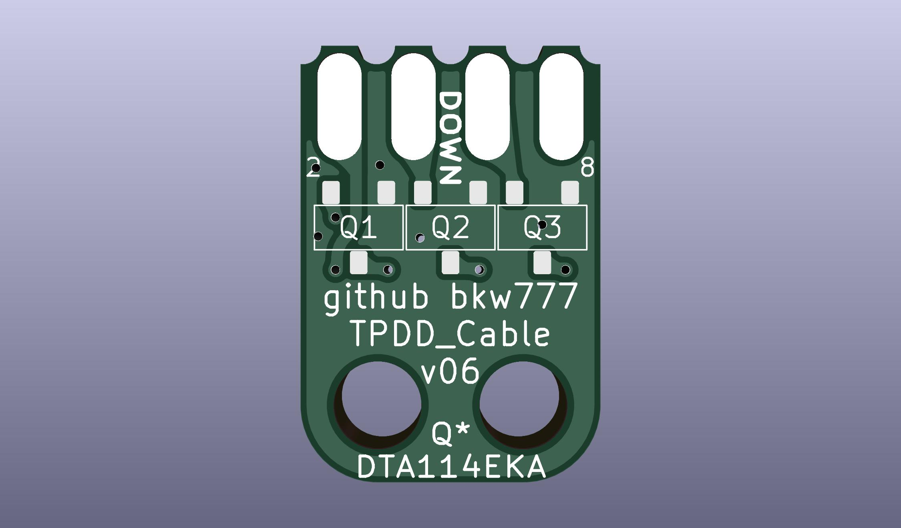

# Cable for [Tandy Portable Disk Drive](http://tandy.wiki/TPDD)

# Parts
<!-- PCB: [OSHPark](https://oshpark.com/shared_projects/Vseg3jxr) or [PCBWAY](https://www.pcbway.com/project/shareproject/TANDY_Portable_Disk_Drive_Cable.html) -->  
BOM: [DigiKey](https://www.digikey.com/short/t9b9h4vq)  

The BOM includes a grey cable. This [black cable](https://www.digikey.com/short/wbpp81nt) can be substituted if you want.

If using Elecrow, PCBWAY, or JLCPCB, you can upload the [housing](HOUSING/out) STL file to have it printed at the same time as the PCBs are being made. Choose nylon/PA11/PA12 material, SLS or MJF print method.  

# Directions

[pictures of build process](build_pics/build_pics.md)
<!--
Assembly pictures: <https://photos.app.goo.gl/TdYxGhzK94KT9rS78>
(old method before the 3d-printed housing)
-->

If you want to make 2 cables, one for Model 100 & clones and one for PC & WP-2, then buy double the transistors & connectors and cut the cable in half right in the middle.  
Otherwise just cut the 9-pin plug off the cable to make one long cable for Model 100 & clones.

## prepare the cable
Strip about 40mm of the the cable jacket.  
Apply a bit of flux to the end of each cut wire and add a bit of solder to the iron tip and touch the iron to the end of the wire to heat and tin the wire until the insulation melts and shrinks back about 1-2mm. You should be left with about 1-2mm of tinned wire exposed.  
Use a DMM in continuity mode to identify which color wires go to which pin numbers on the DB25M connector.  
The table below should be correct for the exact cables linked here, but verify the color-to-pin-number of your actual cable before soldering.  
Otherwise, fill in your own table like the ones below for your particular cable.  
Cut the unused wires short.  
Thread the 3d-printed housing onto the cable, with the rectangular opening facing the cut end of the cable.  
Thread 40mm of heatshrink onto the cable.

## solder the pcb
Solder the center transistor first, then the left & right transistors to minimize alignment errors.  
Then solder the 2x4 connector, optionally using the 3d-printed jig to hold the 2x4 connector in the perfect alignment.  

## solder the wires to the pcb
Use a DMM in continuity mode to beep out the wires to find which color wire is connected to DB25 pin 2, 3, 4, 5, 6, 7, and 20.  
Any other wires are not used and can be cut short right at the jacket.  
Refer to one of the tables below to find which wires to solder to which pcb pads.  
The signal names on the PCB are relative to the computer, aka the DTE side.  
Ex: The pad labelled RTS on the PCB connects to the computers RTS.  
The tables below show the computer-side pinouts for a few different computers.

## assemble the housing
Slide the heat-shrink 2mm past the end of the end of the cable jacket, just enough to cover the unused cut wires and shielding, and shrink it.  
Slide the housing up over the pcb.  
**Make sure the transistors face DOWN, and the polarity key points UP**.  
Push the cable into the pocket as far as possible. Make sure the jacket goes far enough in to be grabbed by the cable tie.  
Put a small 2mm bend at the very tip of the cable tie in the same direction it's already bent (the direction it will bend to wrap around the cable), to help it make the transition from the bottom up into the 2nd hole in the PCB.  
Insert a cable tie from above down into in the opening, with the inside of the strap facing the cable.  
Push the tie down and in so that it fishes under the pcb, up the other side, back over the top, and back out the opening on top.  
It is generally impossible to pull the cable tie from the tip, as the sharp pcb edges bite into the strap. You must push the strap in with needle nose pliars about 1 cm at a time, and don't try to thread the tip into the head until the strap is mostly all the way in.  
Seat the cable as far in as possible and cinch the cable tie tight. Flush-cut the cable tie at the head.

The cable tie does double duty, clamping the cable to the pcb and also locking the pcb in the housing.
Once you have tested the cable and are sure the connections are correct, it won't hurt to inject some glue into the housing to immobilize the wires so they don't break, and to prevent the cable from pulling out of the cable tie. Almost any kind will do. C-A glue (superglue), vynil glue (goop, e6000), hot-glue, etc. 

# Cable Wiring Options

For convenience, the tables below show the wire colors for the specific cables linked here.  
If you buy one of these exact specific cables, then your cable should match one of the tables below, but still verify the wire colors to pin numbers before soldering.

If you use any other cable that isn't specifically from one of the links here, then ignore the colors in the tables below and map out your cables wire colors yourself with a DMM continuity beeper.

The grey cable in the BOM, and the alternative black cable, has both a DB25M on one end and a DE9F on the other end, so you can use the same BOM to make either a "Model T" cable, or a PC cable, or one of each if you double up the other components.

## DB25 Male cable for TRS-80 Model 100 and other KC-85 clones
This is the standard version of the cable that replicates the cable that originally shipped with the TPDD and TPDD2 drives.

The cable in the BOM has a DB25 Male on one end which supports this option.

It supports the following machines:

 Kyotronic KC-85  
 TRS-80/TANDY Model 100, 102, 200, 600  
 NEC PC-8201, PC-8300, PC-8401, PC-8500  
 Olivetti M10  

[PRINTABLE WIRE COLOR WORKSHEET for KC-85 CLONES](DB25M_DTE_Wire_Chart.html)

<table border=1 cellspacing=0>
<caption>TPDD to Model 100</caption>
<tr>
<th colspan=2 width=35%>PCB PAD</th>
<th><a href="https://www.digikey.com/short/w8zz83q5">GREY CABLE</a></th>
<th><a href="https://www.digikey.com/short/wbpp81nt">BLACK CABLE</a></th>
<th colspan=2 width=35%>DB25 PIN</th>
</tr>
<tr>
<td rowspan=99 cellpadding=0></td>
<td>TX</td>
<td>Orange</td>
<td>Red</td>
<td>2</td>
<td rowspan=99 cellpadding=0></td>
</tr>
<!--<tr><td>TX</td><td>Orange</td><td>Red</td><td>2</td></tr>-->
<tr><td>RX</td><td>Red</td><td>Brown</td><td>3</td></tr>
<tr><td>RTS</td><td>Purple</td><td>Blue</td><td>4</td></tr>
<tr><td>CTS</td><td>Grey</td><td>Purple</td><td>5</td></tr>
<tr><td>DSR</td><td>Blue</td><td>Green</td><td>6</td></tr>
<tr><td>GND</td><td>Green</td><td>Yellow</td><td>7</td></tr>
<tr><td>DTR</td><td>Yellow</td><td>Orange</td><td>20</td></tr>
</table>

To verify the final result, check the following with a DMM in Continuity and Diode modes.

<table border=1 cellspacing=0>
<tr>
<th rowspan=99 width=35%></th>
<th>BLACK</th><th>CONT</th><th>DIODE</th><th>RED</th>
<th rowspan=99 width=35%></th>
</tr>
<tr><td>1</td><td>BEEP</td><td></td><td>7</td></tr>
<tr><td>2</td><td>BEEP</td><td></td><td>4</td></tr>
<tr><td>3</td><td></td><td>1.7v</td><td>6</td></tr>
<tr><td>4</td><td></td><td>1.7v</td><td>5</td></tr>
<tr><td>5</td><td>BEEP</td><td></td><td>20</td></tr>
<tr><td>6</td><td></td><td>1.7v</td><td>3</td></tr>
<tr><td>7</td><td>BEEP</td><td></td><td>2</td></tr>
</table>

## DE9 Female cable for Standard PC 9-pin COM port
For modern PCs and usb-serial adapters, TANDY WP-2, Atari Portfolio, and anything else with a standard DE9M DTE port.

The cable in the BOM has a DE9 Female on one end which supports this option.

[PRINTABLE WIRE COLOR WORKSHEET for PC/WP-2](DE9F_DTE_Wire_Chart.html)

<table border=1 cellspacing=0>
<caption>TPDD to PC</caption>
<tr>
<th colspan=2 width=35%>PCB PAD</th>
<th colspan=2 width=35%>DE9 PIN</th>
</tr>
<tr>
<td rowspan=99 cellpadding=0></td>
<td>RX</td>
<td>2</td>
<td rowspan=99 cellpadding=0></td>
</tr>
<!--<tr><td>RXD</td><td>2</td></tr>-->
<tr><td>TX</td><td>3</td></tr>
<tr><td>DTR</td><td>4</td></tr>
<tr><td>GND</td><td>5</td></tr>
<tr><td>DSR</td><td>6</td></tr>
<tr><td>RTS</td><td>7</td></tr>
<tr><td>CTS</td><td>8</td></tr>
</table>

To verify the final result, check the following with a DMM in Continuity and Diode modes.

<table border=1 cellspacing=0>
<tr>
<th rowspan=99 width=35%></th>
<th>BLACK</th><th>CONT</th><th>DIODE</th><th>RED</th>
<th rowspan=99 width=35%></th>
</tr>
<tr><td>1</td><td>BEEP</td><td></td><td>5</td></tr>
<tr><td>2</td><td>BEEP</td><td></td><td>7</td></tr>
<tr><td>3</td><td></td><td>1.7v</td><td>6</td></tr>
<tr><td>4</td><td></td><td>1.7v</td><td>8</td></tr>
<tr><td>5</td><td>BEEP</td><td></td><td>4</td></tr>
<tr><td>6</td><td></td><td>1.7v</td><td>2</td></tr>
<tr><td>7</td><td>BEEP</td><td></td><td>3</td></tr>
</table>

## Cambridge Z88
**UNTESTED**  
*The Cambridge Z88 RS-232 port has a non-standard pinout.*  
*Do not connect this cable to anything but a Cambridge Z88.*

You need a different cable than what's in the BOM above.  
Delete the cable in the pre-loaded cart, and add [this one](https://www.digikey.com/short/mrf9n7nh) instead.  

<table border=1 cellspacing=0>
<caption>TPDD to Z88</caption>
<tr>
<th colspan=2 width=35%>PCB PAD</th>
<th colspan=2 width=35%>DE9 PIN</th>
</tr>
<tr>
<td rowspan=99 cellpadding=0></td>
<td>RX</td>
<td>2</td>
<td rowspan=99 cellpadding=0></td>
</tr>
<!--<tr><td>TX</td><td>2</td></tr>-->
<tr><td>RX</td><td>3</td></tr>
<tr><td>RTS</td><td>4</td></tr>
<tr><td>CTS</td><td>5</td></tr>
<tr><td>GND</td><td>7</td></tr>
<tr><td>DSR</td><td>8</td></tr>
<tr><td>DTR</td><td>9</td></tr>
</table>

# Credits / History
In the beginning, there was the [Marty Goodman Document](https://raw.githubusercontent.com/LivingM100SIG/Living_M100SIG/main/M100SIG/Lib-09-PERIFERALS/TPDD.DO), and it was good.

More recently, Rick Shear has taken a new and very careful look at a real cable, and the Marty Goodman doc, and has probably identified the "mystery" components that Marty Goodman talks about. It looks right, and the circuit does indeed work.  
[Rick's initial post](https://rsmicro.wordpress.com/2018/08/26/tpdd-cable/)  
[Rick's follow-up](https://rsmicro.wordpress.com/2018/09/08/built-tpdd-cable-comparison-to-oem/)

This cable uses the same transistors, but a different physical construction.
